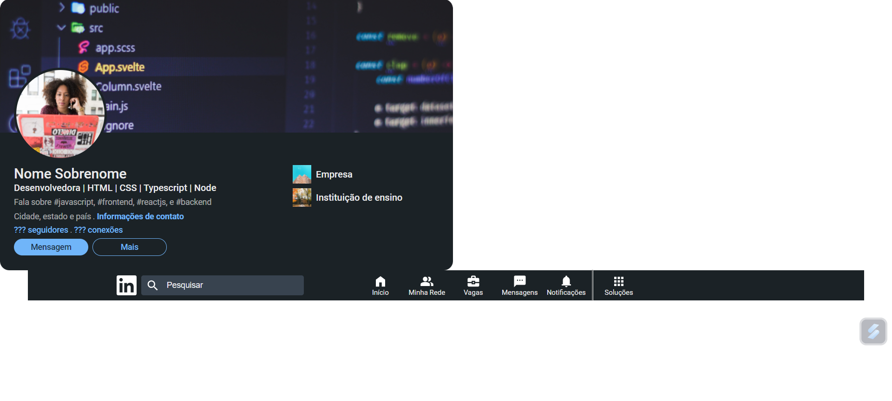
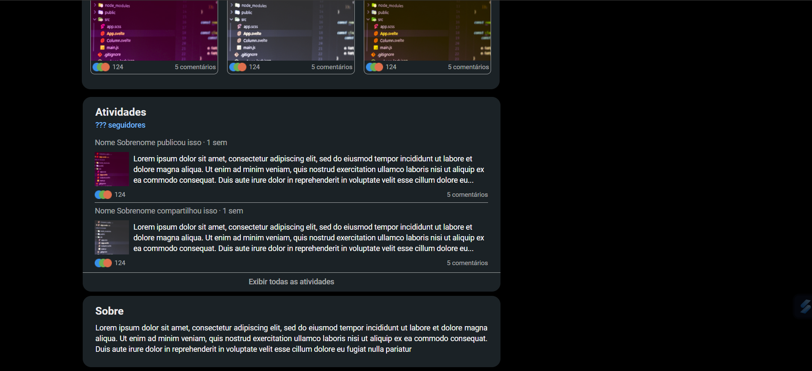
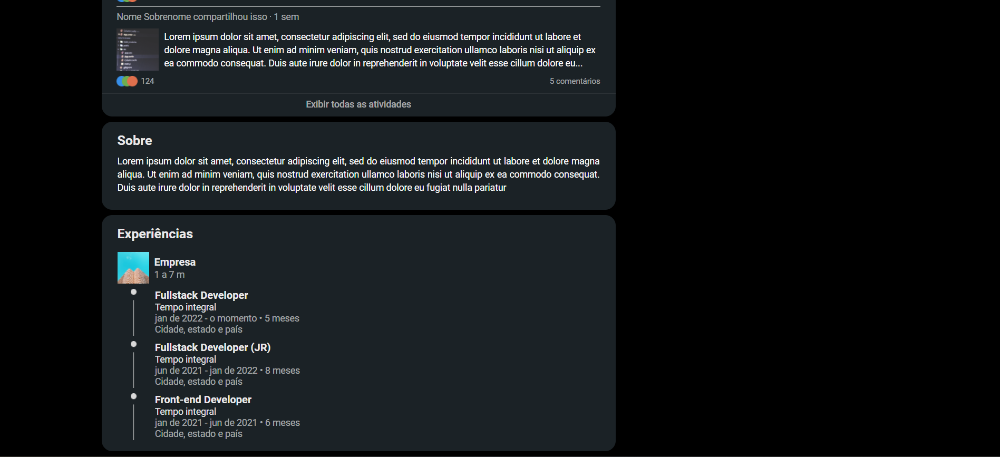
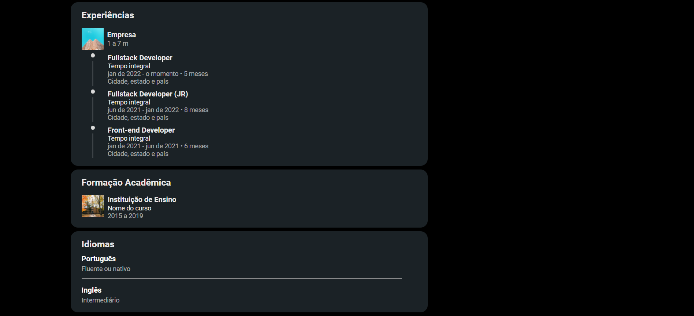
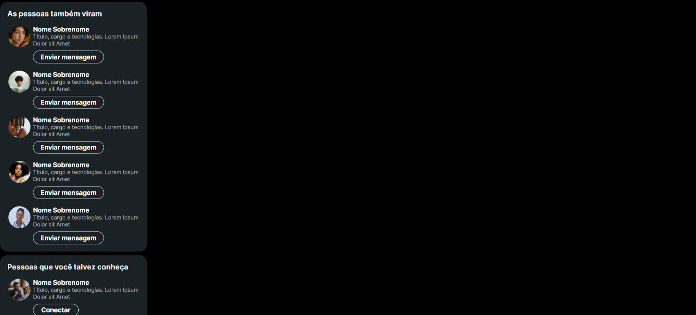
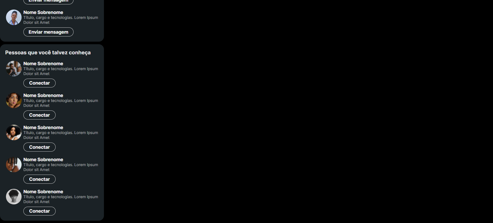

<h1>#7DaysOfCode - Linkedin</h1>

Segundo desafio do 7DaysOfCode que estou fazendo. Dessa vez é para criar, com HTML e CSS, a página de um perfil no LinkedIn.

Faço um commit para cada dia que posto!

 
<h2>Primeiro Dia</h2>

<strong>Informações principais do perfil</strong>

 
<h2>Segundo Dia</h2>

<strong>Menu de Navegação</strong>

Obs.: eu (ainda) não consegui tirar aquela duplicação da linha de separação (hr)

 
<h2>Terceiro Dia</h2>

<strong>Publicações em Destaque</strong>

Ajustei a página pra já ficar mais parecida com a original e mais algumas coisas dos dias anteriores. Arrumei inclusive a linha duplicada, mas não está visível porque levei o menu de navegação pra cima.

 
<h2>Quarto Dia</h2>

<strong>Atividades Recentes e Sobre</strong>

 
<h2>Quinto Dia</h2>

<strong>Experiências</strong>

 
<h2>Sexto Dia</h2>

<strong>Formação Acadêmica e Idiomas</strong>

 
<h2>Sétimo Dia</h2>

<strong>Seções de Sugestões de Perfis</strong>

Desfiz as margens à esquerda dos cards pra arrumar a organização deles no site do jeito certo, mas ainda tô descobrindo como faz isso.
 
